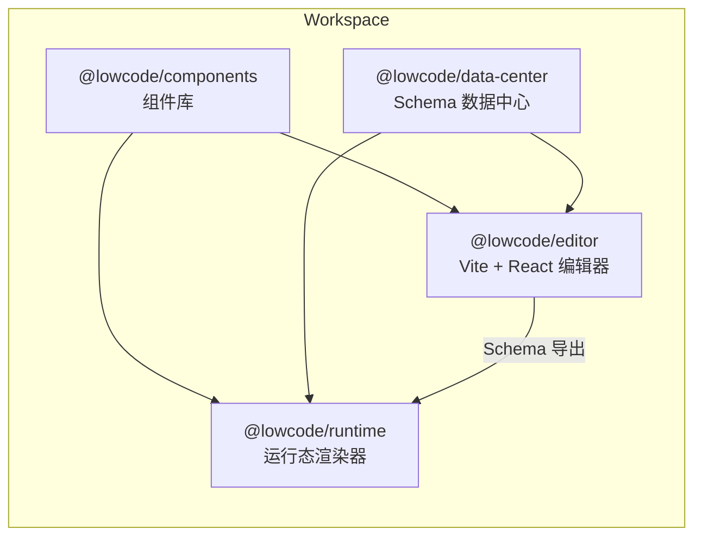

## Low-code 微前端平台

该仓库采用 pnpm workspace 管理多个模块化套餐，面向企业建站与 H5 活动页的低代码场景。

### 包结构
- `@lowcode/editor`：主编辑器应用，内置拖拽画布、属性面板与组件调度
- `@lowcode/components`：跨平台复用的业务组件库
- `@lowcode/runtime`：页面渲染引擎，可在落地页或线上运行态直接复用
- `@lowcode/data-center`：统一数据中心，负责页面 schema、选中状态等

### 快速开始
```bash
pnpm install
pnpm dev # 启动编辑器
```

可通过 `pnpm --filter @lowcode/runtime dev` 启动渲染引擎示例。

### 架构图


### 构建与测试
- `pnpm test`：运行所有包的 Vitest 用例（组件库、运行时、数据中心、编辑器）
- `pnpm build`：依次执行各包构建（tsc/Vite）
- `pnpm lint`：基于 TypeScript 严格模式的静态检查

### 技术栈
- React + TypeScript
- Vite 构建
- 自研 DataCenter + 组件注册表实现模块解耦
